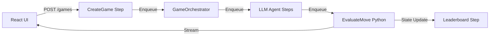

[ChessArena.ai](https://chessarena.ai) is a complete production application built with Motia that benchmarks LLM chess-playing abilities with real-time move evaluation and live leaderboards.

<CardGroup cols={2}>
  <Card title="Live website" icon="globe" href="https://chessarena.ai">
    Try the live application
  </Card>
  <Card title="Source code" icon="github" href="https://github.com/MotiaDev/chessarena-ai">
    View the complete source code
  </Card>
</CardGroup>

## What it demonstrates

- Authentication and user management
- Multi-agent LLM evaluation (OpenAI, Claude, Gemini, Grok)
- Python engine integration (Stockfish chess evaluation)
- Real-time streaming with live move updates
- Event-driven workflows connecting TypeScript and Python
- Modern React UI with interactive chess boards
- Production deployment on Motia Cloud

## Architecture overview

ChessArena uses multiple Motia Steps to orchestrate the chess evaluation pipeline:



### Key components

1. **Game orchestrator**: Manages game flow and turn sequence
2. **LLM agents**: Separate Steps for each LLM provider
3. **Move evaluator**: Python Step using Stockfish engine
4. **Streaming pipeline**: Real-time updates via Motia streams
5. **Leaderboard**: Aggregates move quality scores

## Core Steps

### Game creation

The entry point that initializes a new chess match:

```typescript steps/create-game.step.ts
import type { Handlers, StepConfig } from 'motia'
import { z } from 'zod'

export const config = {
  name: 'CreateGame',
  triggers: [
    {
      type: 'http',
      method: 'POST',
      path: '/games',
      bodySchema: z.object({
        whitePlayer: z.enum(['gpt4', 'claude', 'gemini', 'grok']),
        blackPlayer: z.enum(['gpt4', 'claude', 'gemini', 'grok']),
        timeControl: z.object({
          minutes: z.number(),
          increment: z.number(),
        }),
      }),
      responseSchema: {
        200: z.object({
          gameId: z.string(),
          status: z.string(),
          streamUrl: z.string(),
        }),
      },
    },
  ],
  enqueues: ['game.started'],
} as const satisfies StepConfig

export const handler: Handlers<typeof config> = async (
  request,
  { enqueue, state, logger }
) => {
  const { whitePlayer, blackPlayer, timeControl } = request.body
  const gameId = `game-${Date.now()}`

  // Initialize game state
  await state.set('games', gameId, {
    id: gameId,
    whitePlayer,
    blackPlayer,
    timeControl,
    moves: [],
    currentTurn: 'white',
    status: 'active',
    startedAt: new Date().toISOString(),
  })

  // Start game orchestration
  await enqueue({
    topic: 'game.started',
    data: { gameId },
  })

  logger.info('Game created', { gameId, whitePlayer, blackPlayer })

  return {
    status: 200,
    body: {
      gameId,
      status: 'started',
      streamUrl: `/streams/game/${gameId}`,
    },
  }
}
```

### LLM agent Step

Each LLM provider has a dedicated Step for move generation:

```typescript steps/agents/gpt4-agent.step.ts
import type { Handlers, StepConfig } from 'motia'
import { z } from 'zod'
import OpenAI from 'openai'

const inputSchema = z.object({
  gameId: z.string(),
  position: z.string(), // FEN notation
  moveHistory: z.array(z.string()),
})

export const config = {
  name: 'GPT4Agent',
  triggers: [
    {
      type: 'queue',
      topic: 'agent.gpt4.move',
      input: inputSchema,
    },
  ],
  enqueues: ['move.generated'],
} as const satisfies StepConfig

const openai = new OpenAI({
  apiKey: process.env.OPENAI_API_KEY,
})

export const handler: Handlers<typeof config> = async (
  input,
  { enqueue, logger, streams }
) => {
  const { gameId, position, moveHistory } = input

  logger.info('GPT-4 generating move', { gameId, position })

  // Stream thinking process to frontend
  await streams.game.append(gameId, {
    type: 'thinking',
    agent: 'gpt4',
    timestamp: new Date().toISOString(),
  })

  const response = await openai.chat.completions.create({
    model: 'gpt-4',
    messages: [
      {
        role: 'system',
        content: `You are a chess grandmaster. Given a position in FEN notation, respond with your next move in algebraic notation.`,
      },
      {
        role: 'user',
        content: `Position: ${position}\nMove history: ${moveHistory.join(', ')}\nWhat is your next move?`,
      },
    ],
  })

  const move = response.choices[0].message.content.trim()

  // Enqueue for evaluation
  await enqueue({
    topic: 'move.generated',
    data: {
      gameId,
      move,
      agent: 'gpt4',
      timestamp: new Date().toISOString(),
    },
  })

  logger.info('GPT-4 move generated', { gameId, move })
}
```

### Python move evaluator

Stockfish evaluation runs in a Python Step:

```python steps/evaluate_move_step.py
import chess
import chess.engine
import logging

config = {
    "name": "EvaluateMove",
    "triggers": [
        {
            "type": "queue",
            "topic": "move.generated",
        }
    ],
    "enqueues": ["move.evaluated"],
}

# Initialize Stockfish engine
engine = chess.engine.SimpleEngine.popen_uci("/usr/local/bin/stockfish")

async def handler(input, ctx):
    game_id = input["gameId"]
    move = input["move"]
    agent = input["agent"]
    
    ctx.logger.info(f"Evaluating move: {move} for {agent}")
    
    # Parse board position
    board = chess.Board(input["position"])
    
    # Evaluate move quality
    info = engine.analyse(board, chess.engine.Limit(time=0.1))
    score_before = info["score"].relative.score()
    
    # Make the move
    board.push_san(move)
    
    info = engine.analyse(board, chess.engine.Limit(time=0.1))
    score_after = info["score"].relative.score()
    
    # Calculate move quality
    quality_score = calculate_quality(score_before, score_after)
    
    # Stream evaluation to frontend
    await ctx.streams.game.append(game_id, {
        "type": "move_evaluated",
        "move": move,
        "agent": agent,
        "quality": quality_score,
        "score_before": score_before,
        "score_after": score_after,
        "timestamp": datetime.now().isoformat(),
    })
    
    # Update game state
    await ctx.state.update("games", game_id, {
        "lastMove": {
            "move": move,
            "agent": agent,
            "quality": quality_score,
        }
    })
    
    # Enqueue for leaderboard update
    await ctx.enqueue({
        "topic": "move.evaluated",
        "data": {
            "gameId": game_id,
            "agent": agent,
            "quality": quality_score,
        },
    })
    
    ctx.logger.info(f"Move evaluated: {move} quality={quality_score}")

def calculate_quality(before, after):
    # Score move quality on 0-100 scale
    diff = after - before
    if diff > 100:
        return 100
    elif diff < -100:
        return 0
    else:
        return 50 + (diff / 2)
```

### Real-time streaming

The game stream configuration:

```typescript steps/game.stream.ts
import type { StreamConfig } from 'motia'
import { z } from 'zod'

const gameEventSchema = z.discriminatedUnion('type', [
  z.object({
    type: z.literal('thinking'),
    agent: z.string(),
    timestamp: z.string(),
  }),
  z.object({
    type: z.literal('move_evaluated'),
    move: z.string(),
    agent: z.string(),
    quality: z.number(),
    score_before: z.number(),
    score_after: z.number(),
    timestamp: z.string(),
  }),
  z.object({
    type: z.literal('game_over'),
    winner: z.string(),
    reason: z.string(),
    timestamp: z.string(),
  }),
])

export const config: StreamConfig = {
  name: 'game',
  schema: gameEventSchema,
  baseConfig: { storageType: 'default' },

  onJoin: async (subscription, context) => {
    context.logger.info('Client joined game stream', {
      gameId: subscription.groupId,
    })
    return { unauthorized: false }
  },

  onLeave: async (subscription, context) => {
    context.logger.info('Client left game stream', {
      gameId: subscription.groupId,
    })
  },
}
```

## Frontend integration

React component using Motia's streaming client:

```typescript components/GameBoard.tsx
import { useMotiaStream } from 'motia-stream-client-react'
import { useState } from 'react'

interface GameBoardProps {
  gameId: string
}

export function GameBoard({ gameId }: GameBoardProps) {
  const [moves, setMoves] = useState([])
  const [evaluation, setEvaluation] = useState(null)

  const stream = useMotiaStream({
    url: 'http://localhost:3000',
    streamName: 'game',
    groupId: gameId,
  })

  stream.on('move_evaluated', (event) => {
    setMoves((prev) => [...prev, event])
    setEvaluation(event.quality)
  })

  return (
    <div>
      <ChessBoard moves={moves} />
      <MoveQuality score={evaluation} />
    </div>
  )
}
```

## Key features

### Multi-language support

- **TypeScript**: API endpoints, orchestration, frontend
- **Python**: Chess engine integration, evaluation logic
- Seamless communication via queues and state

### Real-time updates

- Live move streaming to frontend
- Progress indicators during AI thinking
- Move quality visualization
- Leaderboard updates

### Production deployment

- Deployed on Motia Cloud
- Auto-scaling workers
- Distributed state management
- Monitoring and observability

## Run it yourself

Clone and run the project:

```bash
git clone https://github.com/MotiaDev/chessarena-ai.git
cd chessarena-ai
npm install

# Set up environment variables
cp .env.example .env
# Add your API keys for OpenAI, Anthropic, etc.

# Start the iii engine
iii -c iii-config.yaml

# Start the frontend
npm run dev
```

Visit `http://localhost:5173` to start a game.

## What you learned

<CardGroup cols={2}>
  <Card title="Multi-language Steps" icon="code" href="/guides/multi-language">
    Mix TypeScript and Python in one application
  </Card>
  <Card title="Real-time streaming" icon="signal" href="/concepts/streams">
    Stream events to frontend with Motia streams
  </Card>
  <Card title="Event-driven workflows" icon="workflow" href="/guides/workflows">
    Chain multiple Steps with queue-based events
  </Card>
  <Card title="Production deployment" icon="rocket" href="/advanced/deployment">
    Deploy and scale on Motia Cloud
  </Card>
</CardGroup>

## Next steps

<CardGroup cols={2}>
  <Card title="AI research agent" icon="magnifying-glass" href="/examples/ai-research-agent">
    Build an AI agent with web research
  </Card>
  <Card title="More examples" icon="folder" href="https://github.com/MotiaDev/motia-examples">
    Explore 20+ examples on GitHub
  </Card>
</CardGroup>
