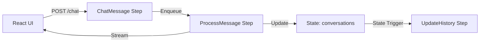

This example demonstrates building a production-ready streaming chatbot with:
- Real-time AI responses using Server-Sent Events (SSE)
- Conversation history management
- Multi-user support with isolated sessions
- Stream-based real-time updates

<Card title="View source code" icon="github" href="https://github.com/MotiaDev/motia-examples/tree/main/examples/streaming-ai-chatbot">
  Complete source code on GitHub
</Card>

## What you'll build

A chatbot system with:
- HTTP endpoint for sending messages
- Streaming LLM responses
- Persistent conversation history
- Real-time UI updates via Motia streams

## Architecture



## Step 1: Create chat endpoint

Create `steps/chat-message.step.ts` to receive messages:

```typescript steps/chat-message.step.ts
import type { Handlers, StepConfig } from 'motia'
import { z } from 'zod'

export const config = {
  name: 'ChatMessage',
  description: 'Receive chat messages and enqueue for processing',
  triggers: [
    {
      type: 'http',
      method: 'POST',
      path: '/chat',
      bodySchema: z.object({
        message: z.string().min(1).max(2000),
        conversationId: z.string().optional(),
        userId: z.string(),
      }),
      responseSchema: {
        200: z.object({
          conversationId: z.string(),
          messageId: z.string(),
          status: z.string(),
        }),
      },
    },
  ],
  enqueues: ['chat.process'],
} as const satisfies StepConfig

export const handler: Handlers<typeof config> = async (
  request,
  { enqueue, state, logger, streams }
) => {
  const { message, conversationId, userId } = request.body
  const convId = conversationId || `conv-${Date.now()}-${Math.random().toString(36).substring(7)}`
  const messageId = `msg-${Date.now()}`

  logger.info('Received chat message', { convId, messageId, userId })

  // Get or create conversation
  let conversation = await state.get('conversations', convId)
  if (!conversation) {
    conversation = {
      id: convId,
      userId,
      messages: [],
      createdAt: new Date().toISOString(),
    }
    await state.set('conversations', convId, conversation)
  }

  // Add user message to conversation
  conversation.messages.push({
    id: messageId,
    role: 'user',
    content: message,
    timestamp: new Date().toISOString(),
  })

  await state.update('conversations', convId, {
    messages: conversation.messages,
  })

  // Stream user message to frontend
  await streams.chat.append(convId, {
    type: 'user_message',
    messageId,
    content: message,
    timestamp: new Date().toISOString(),
  })

  // Enqueue for AI processing
  await enqueue({
    topic: 'chat.process',
    data: {
      conversationId: convId,
      messageId,
      message,
      history: conversation.messages,
    },
  })

  return {
    status: 200,
    body: {
      conversationId: convId,
      messageId,
      status: 'processing',
    },
  }
}
```

## Step 2: Process with streaming

Create `steps/process-message.step.ts` for AI processing with streaming:

```typescript steps/process-message.step.ts
import type { Handlers, StepConfig } from 'motia'
import { z } from 'zod'
import OpenAI from 'openai'

const inputSchema = z.object({
  conversationId: z.string(),
  messageId: z.string(),
  message: z.string(),
  history: z.array(
    z.object({
      role: z.enum(['user', 'assistant']),
      content: z.string(),
    })
  ),
})

export const config = {
  name: 'ProcessMessage',
  description: 'Process chat messages with streaming AI responses',
  triggers: [
    {
      type: 'queue',
      topic: 'chat.process',
      input: inputSchema,
    },
  ],
} as const satisfies StepConfig

const openai = new OpenAI({
  apiKey: process.env.OPENAI_API_KEY,
})

export const handler: Handlers<typeof config> = async (
  input,
  { state, logger, streams }
) => {
  const { conversationId, messageId, message, history } = input

  logger.info('Processing message with AI', { conversationId, messageId })

  // Stream thinking status
  await streams.chat.append(conversationId, {
    type: 'assistant_thinking',
    timestamp: new Date().toISOString(),
  })

  // Prepare conversation history for OpenAI
  const messages = history.map((msg) => ({
    role: msg.role as 'user' | 'assistant',
    content: msg.content,
  }))

  // Stream response from OpenAI
  const stream = await openai.chat.completions.create({
    model: 'gpt-4',
    messages: [
      {
        role: 'system',
        content: 'You are a helpful assistant. Provide clear, concise, and friendly responses.',
      },
      ...messages,
    ],
    stream: true,
  })

  let fullResponse = ''
  const assistantMessageId = `msg-${Date.now()}`

  // Stream each chunk to frontend
  for await (const chunk of stream) {
    const content = chunk.choices[0]?.delta?.content || ''
    if (content) {
      fullResponse += content

      // Stream chunk to frontend
      await streams.chat.append(conversationId, {
        type: 'assistant_chunk',
        messageId: assistantMessageId,
        content,
        timestamp: new Date().toISOString(),
      })
    }
  }

  // Stream completion
  await streams.chat.append(conversationId, {
    type: 'assistant_complete',
    messageId: assistantMessageId,
    fullResponse,
    timestamp: new Date().toISOString(),
  })

  // Update conversation history
  const conversation = await state.get('conversations', conversationId)
  conversation.messages.push({
    id: assistantMessageId,
    role: 'assistant',
    content: fullResponse,
    timestamp: new Date().toISOString(),
  })

  await state.update('conversations', conversationId, {
    messages: conversation.messages,
    updatedAt: new Date().toISOString(),
  })

  logger.info('Message processed', {
    conversationId,
    assistantMessageId,
    responseLength: fullResponse.length,
  })
}
```

## Step 3: Configure the chat stream

Create `steps/chat.stream.ts` for real-time updates:

```typescript steps/chat.stream.ts
import type { StreamConfig } from 'motia'
import { z } from 'zod'

const chatEventSchema = z.discriminatedUnion('type', [
  z.object({
    type: z.literal('user_message'),
    messageId: z.string(),
    content: z.string(),
    timestamp: z.string(),
  }),
  z.object({
    type: z.literal('assistant_thinking'),
    timestamp: z.string(),
  }),
  z.object({
    type: z.literal('assistant_chunk'),
    messageId: z.string(),
    content: z.string(),
    timestamp: z.string(),
  }),
  z.object({
    type: z.literal('assistant_complete'),
    messageId: z.string(),
    fullResponse: z.string(),
    timestamp: z.string(),
  }),
])

export const config: StreamConfig = {
  name: 'chat',
  schema: chatEventSchema,
  baseConfig: { storageType: 'default' },

  onJoin: async (subscription, context) => {
    context.logger.info('User joined chat', {
      conversationId: subscription.groupId,
    })
    return { unauthorized: false }
  },

  onLeave: async (subscription, context) => {
    context.logger.info('User left chat', {
      conversationId: subscription.groupId,
    })
  },
}
```

## Step 4: Alternative - SSE endpoint

For direct SSE without Motia streams, create `steps/chat-sse.step.ts`:

```typescript steps/chat-sse.step.ts
import { type Handlers, http, type StepConfig } from 'motia'
import OpenAI from 'openai'

export const config = {
  name: 'ChatSSE',
  description: 'Stream chat responses via Server-Sent Events',
  triggers: [http('POST', '/chat/stream')],
} as const satisfies StepConfig

const openai = new OpenAI({
  apiKey: process.env.OPENAI_API_KEY,
})

export const handler: Handlers<typeof config> = async (
  { request, response },
  { logger }
) => {
  logger.info('SSE chat request received')

  // Set SSE headers
  response.status(200)
  response.headers({
    'content-type': 'text/event-stream',
    'cache-control': 'no-cache',
    connection: 'keep-alive',
  })

  // Parse request body
  const chunks: string[] = []
  for await (const chunk of request.requestBody.stream) {
    chunks.push(Buffer.from(chunk).toString('utf-8'))
  }
  const body = JSON.parse(chunks.join(''))
  const { message, history = [] } = body

  // Stream thinking event
  response.stream.write(
    `event: thinking\ndata: ${JSON.stringify({ status: 'processing' })}\n\n`
  )

  // Get streaming response from OpenAI
  const stream = await openai.chat.completions.create({
    model: 'gpt-4',
    messages: [
      {
        role: 'system',
        content: 'You are a helpful assistant.',
      },
      ...history,
      { role: 'user', content: message },
    ],
    stream: true,
  })

  // Stream each chunk
  for await (const chunk of stream) {
    const content = chunk.choices[0]?.delta?.content || ''
    if (content) {
      response.stream.write(`event: chunk\ndata: ${JSON.stringify({ content })}\n\n`)
    }
  }

  // Stream done event
  response.stream.write(`event: done\ndata: ${JSON.stringify({ complete: true })}\n\n`)
  response.close()
}
```

## Frontend: React integration

Connect to the chat stream:

```typescript components/ChatWindow.tsx
import { useMotiaStream } from 'motia-stream-client-react'
import { useState } from 'react'

interface Message {
  id: string
  role: 'user' | 'assistant'
  content: string
  timestamp: string
}

export function ChatWindow({ conversationId }: { conversationId: string }) {
  const [messages, setMessages] = useState<Message[]>([])
  const [currentAssistantMessage, setCurrentAssistantMessage] = useState('')
  const [isThinking, setIsThinking] = useState(false)

  const stream = useMotiaStream({
    url: 'http://localhost:3000',
    streamName: 'chat',
    groupId: conversationId,
  })

  stream.on('user_message', (event) => {
    setMessages((prev) => [
      ...prev,
      {
        id: event.messageId,
        role: 'user',
        content: event.content,
        timestamp: event.timestamp,
      },
    ])
  })

  stream.on('assistant_thinking', () => {
    setIsThinking(true)
    setCurrentAssistantMessage('')
  })

  stream.on('assistant_chunk', (event) => {
    setIsThinking(false)
    setCurrentAssistantMessage((prev) => prev + event.content)
  })

  stream.on('assistant_complete', (event) => {
    setMessages((prev) => [
      ...prev,
      {
        id: event.messageId,
        role: 'assistant',
        content: event.fullResponse,
        timestamp: event.timestamp,
      },
    ])
    setCurrentAssistantMessage('')
  })

  return (
    <div>
      <div className="messages">
        {messages.map((msg) => (
          <div key={msg.id} className={`message ${msg.role}`}>
            <strong>{msg.role}:</strong> {msg.content}
          </div>
        ))}
        {isThinking && <div className="thinking">Assistant is thinking...</div>}
        {currentAssistantMessage && (
          <div className="message assistant streaming">
            <strong>assistant:</strong> {currentAssistantMessage}
          </div>
        )}
      </div>
    </div>
  )
}
```

## Testing the chatbot

Send a message:

```bash
curl -X POST http://localhost:3000/chat \
  -H "Content-Type: application/json" \
  -d '{
    "message": "Hello, how are you?",
    "userId": "user-123"
  }'
```

Response:

```json
{
  "conversationId": "conv-1234567890-abc123",
  "messageId": "msg-1234567890",
  "status": "processing"
}
```

Connect to the stream to see real-time AI response chunks.

## What you learned

<CardGroup cols={2}>
  <Card title="Real-time streaming" icon="signal" href="/guides/real-time-streaming">
    Stream AI responses in real-time
  </Card>
  <Card title="Server-Sent Events" icon="rss">
    Use SSE for one-way server-to-client streaming
  </Card>
  <Card title="Conversation state" icon="database" href="/concepts/state-management">
    Manage conversation history with state
  </Card>
  <Card title="Motia streams" icon="stream" href="/concepts/streams">
    Use Motia streams for real-time updates
  </Card>
</CardGroup>

## Next steps

<CardGroup cols={2}>
  <Card title="Gmail automation" icon="envelope" href="/examples/gmail-automation">
    Build email workflow automation
  </Card>
  <Card title="AI agents guide" icon="robot" href="/guides/ai-agents">
    Learn advanced AI agent patterns
  </Card>
</CardGroup>
